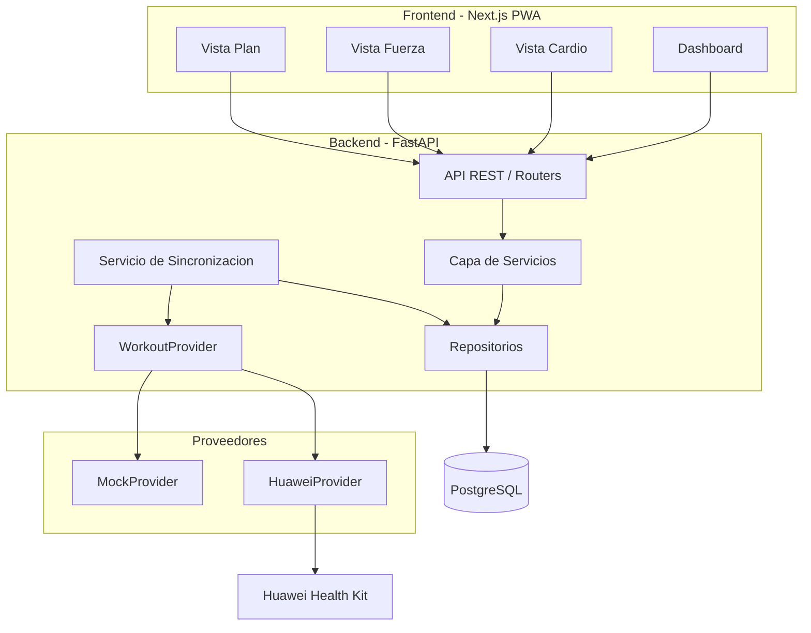
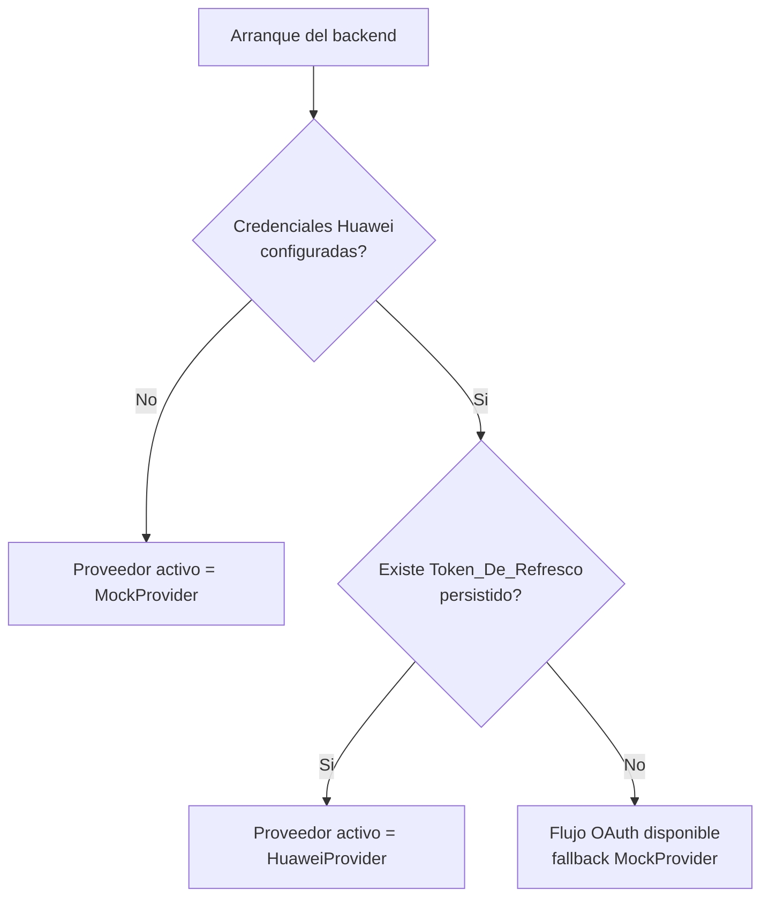
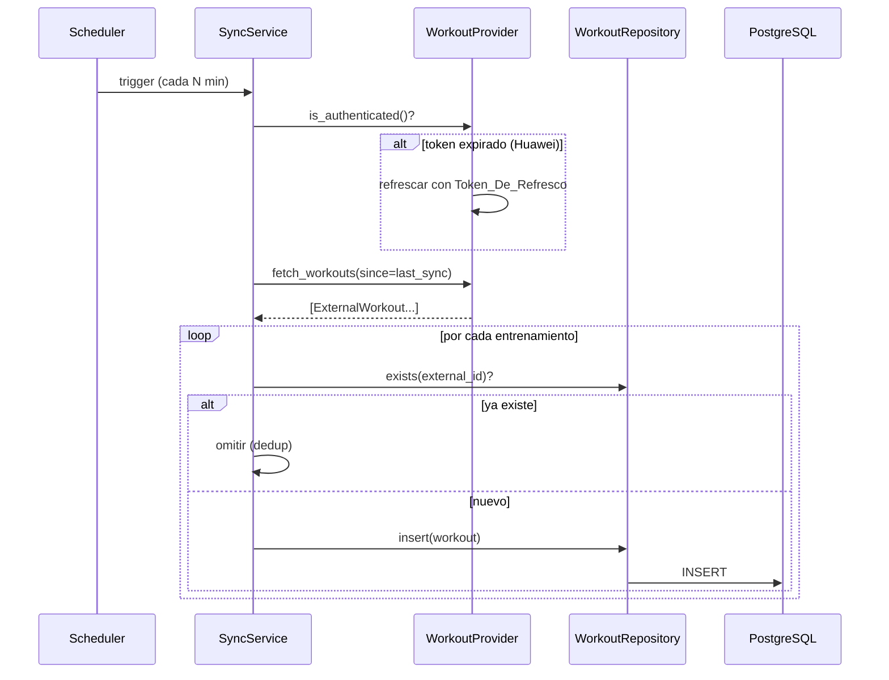

# Design Document

## Overview

Compi es una plataforma personal de entrenamiento (MVP) que sincroniza entrenamientos desde una fuente externa (Huawei Health Kit), los persiste de forma estructurada, calcula métricas de rendimiento y permite planificar mediante periodización (macrociclo → mesociclo → microciclo → sesión planificada), comparando lo planificado con lo realmente ejecutado y exponiendo el resultado a través de una PWA.

El diseño se organiza en cuatro grandes piezas:

1. **Backend FastAPI** con arquitectura por capas (API → servicios → repositorios → modelos).
2. **Capa de sincronización** basada en la abstracción `WorkoutProvider`, con `MockProvider` para desarrollo inmediato y `HuaweiProvider` para producción.
3. **Base de datos PostgreSQL** con un modelo de datos que cubre entrenamientos (cardio/fuerza), detalle de fuerza, jerarquía de periodización y persistencia de tokens OAuth.
4. **Frontend Next.js (PWA)** con dashboard, vistas de entrenamiento cardio/fuerza y vista de plan.

### Decisión técnica resuelta: ORM y migraciones

La decisión abierta documentada en los requisitos (SQLAlchemy + Alembic vs. SQLModel) se resuelve a favor de **SQLModel + Alembic**:

- **SQLModel** (del autor de FastAPI) unifica modelos Pydantic y tablas SQLAlchemy, reduciendo duplicación entre esquemas de validación y entidades de base de datos. Encaja con la preferencia del usuario por una solución ligera para el MVP.
- **SQLModel no incluye migraciones**, por lo que se combina con **Alembic** (el sistema de migraciones estándar de SQLAlchemy, sobre el que SQLModel se apoya). Alembic gestiona la evolución del esquema de forma versionada y reproducible.
- SQLModel se construye sobre SQLAlchemy Core, de modo que si el modelo de datos crece en complejidad (consultas avanzadas, relaciones complejas de periodización) se puede descender al API de SQLAlchemy sin reescribir el modelo.

Esta combinación equilibra ligereza para el MVP con una vía de crecimiento, y satisface el Requirement (decisión abierta) sin bloquear ninguna otra parte del diseño.

## Architecture

### Vista de alto nivel



### Capas del backend

El backend sigue una arquitectura por capas con dependencias unidireccionales (cada capa depende solo de la inferior):

| Capa              | Responsabilidad                                                                                         | Ejemplos                                                                                     |
| ----------------- | ------------------------------------------------------------------------------------------------------- | -------------------------------------------------------------------------------------------- |
| **API / Routers** | Exponer endpoints REST, validar entrada/salida con esquemas, traducir errores de dominio a códigos HTTP | `routers/workouts.py`, `routers/metrics.py`, `routers/plans.py`, `routers/auth.py`           |
| **Servicios**     | Lógica de negocio pura: métricas, progresión, deduplicación, comparación planificado/real               | `services/metrics_service.py`, `services/progression_service.py`, `services/sync_service.py` |
| **Repositorios**  | Acceso a datos, consultas y persistencia mediante SQLModel                                              | `repositories/workout_repo.py`, `repositories/plan_repo.py`, `repositories/token_repo.py`    |
| **Modelos**       | Entidades SQLModel y esquemas Pydantic compartidos                                                      | `models/workout.py`, `models/periodization.py`, `models/auth.py`                             |
| **Proveedores**   | Abstracción `WorkoutProvider` y sus implementaciones                                                    | `providers/base.py`, `providers/mock.py`, `providers/huawei.py`                              |

La **lógica de negocio cuantificable (métricas, progresión, deduplicación) se aísla en funciones puras** dentro de la capa de servicios, lo que permite testearla con property-based testing sin tocar la base de datos ni servicios externos.

### Estructura del repositorio

```
compi/
├── backend/
│   ├── app/
│   │   ├── main.py                 # Inicializacion FastAPI, ciclo de vida, scheduler
│   │   ├── config.py               # Carga de variables de entorno (pydantic-settings)
│   │   ├── db.py                   # Engine SQLModel / sesiones
│   │   ├── models/
│   │   ├── repositories/
│   │   ├── services/
│   │   ├── providers/
│   │   └── routers/
│   ├── alembic/                    # Migraciones
│   ├── tests/
│   ├── pyproject.toml
│   └── Dockerfile
├── frontend/                       # Next.js PWA
├── docs/
├── docker-compose.yml              # PostgreSQL + backend (dev)
├── .gitignore
└── README.md
```

Esto satisface el Requirement 2.1 (directorios `backend/`, `frontend/`, `docs/`), 2.2 (docker-compose con PostgreSQL), 2.3 (configuración por variables de entorno) y 2.4 (README y `.gitignore`).

### Configuración por entorno

`app/config.py` usa `pydantic-settings` para leer variables de entorno, incluyendo `DATABASE_URL`, `HUAWEI_CLIENT_ID`, `HUAWEI_CLIENT_SECRET`, `HUAWEI_REDIRECT_URI` y `SYNC_INTERVAL_MINUTES`. La presencia o ausencia de las credenciales de Huawei determina el proveedor activo (Requirement 1.4 y 5.4).

### Selección del proveedor activo



## Components and Interfaces

### WorkoutProvider (abstracción)

`WorkoutProvider` es una interfaz (clase base abstracta) que define autenticación y descarga de entrenamientos. Permite desarrollar con datos simulados y conectar Huawei real sin cambiar el resto del sistema (Requirement 5).

```python
class ExternalWorkout(BaseModel):
    external_id: str            # Identificador estable de la fuente, clave de deduplicacion
    type: WorkoutType           # cardio | strength
    start_time: datetime
    duration_s: int
    avg_hr: int | None
    max_hr: int | None
    calories: float | None
    cardio: CardioPayload | None
    strength_summary: StrengthSummaryPayload | None

class WorkoutProvider(ABC):
    @abstractmethod
    def authenticate(self) -> AuthResult: ...

    @abstractmethod
    def is_authenticated(self) -> bool: ...

    @abstractmethod
    def fetch_workouts(self, since: datetime) -> list[ExternalWorkout]: ...
```

- **MockProvider** (Requirement 5.2): implementa `WorkoutProvider` devolviendo entrenamientos de prueba realistas (cardio con GPS/pace/splits y fuerza con resumen). No requiere credenciales (Requirement 5.4). Genera `external_id` estables y deterministas para poder ejercitar la deduplicación.
- **HuaweiProvider** (Requirement 5.3, 6.4): implementa `WorkoutProvider` conectándose a Huawei Health Kit vía OAuth. Antes de descargar, comprueba si el `Token_De_Refresco` está expirado y, en ese caso, lo renueva (Requirement 6.4).

### Servicio de Sincronización

`SyncService` ejecuta la descarga periódica desde el `WorkoutProvider` activo mediante un trabajo en segundo plano (APScheduler arrancado en el ciclo de vida de FastAPI). Su flujo:



La lógica de **deduplicación** (Requirement 6.2, 6.3) se implementa como una función pura `partition_new_workouts(existing_ids, fetched)` que separa los entrenamientos en "nuevos" y "omitidos" según `external_id`, lo que la hace testeable con PBT.

### Capa de Servicios de negocio

- **MetricsService** (Requirement 8): calcula zonas de FC, volumen de entrenamiento y carga de entrenamiento.
- **ProgressionService** (Requirement 9): calcula carga objetivo por microciclo con incremento porcentual y deload, y la comparación planificado vs. real.
- **PlanService** (Requirement 4, 7.3): gestiona la jerarquía de periodización y su persistencia.

### API REST

Endpoints principales (Requirement 7). Todos devuelven JSON y usan códigos HTTP estándar; un recurso inexistente devuelve **404 Not Found** (Requirement 7.4).

| Método | Ruta                                 | Descripción                                                  |
| ------ | ------------------------------------ | ------------------------------------------------------------ |
| `GET`  | `/api/workouts`                      | Lista de entrenamientos (filtros por tipo/fecha)             |
| `GET`  | `/api/workouts/{id}`                 | Detalle de un entrenamiento                                  |
| `POST` | `/api/workouts/{id}/strength-detail` | Registro manual de StrengthDetail (Requirement 3.5)          |
| `GET`  | `/api/workouts/{id}/metrics`         | Métricas de un entrenamiento (zonas FC)                      |
| `GET`  | `/api/metrics/volume`                | Volumen de entrenamiento agregado                            |
| `GET`  | `/api/metrics/load`                  | Carga de entrenamiento agregada                              |
| `GET`  | `/api/plans`                         | Lista de macrociclos                                         |
| `POST` | `/api/plans/macrocycles`             | Crear macrociclo                                             |
| `POST` | `/api/plans/mesocycles`              | Crear mesociclo                                              |
| `POST` | `/api/plans/microcycles`             | Crear microciclo                                             |
| `POST` | `/api/plans/sessions`                | Crear sesión planificada (Requirement 4.3)                   |
| `GET`  | `/api/plans/{macro_id}/progression`  | Carga objetivo por microciclo y comparación                  |
| `GET`  | `/api/auth/huawei/login`             | Inicia flujo OAuth (Requirement 1.2)                         |
| `GET`  | `/api/auth/huawei/callback`          | Callback OAuth, persiste Token_De_Refresco (Requirement 1.3) |

### Frontend PWA

Next.js con manifest y service worker (PWA instalable, Requirement 10.1). Estructura de vistas:

- **Dashboard** (`/`): resumen de entrenamientos recientes y métricas clave (Requirement 10.2).
- **Vista Cardio** (`/workouts/[id]` tipo cardio): mapa (GPS), zonas de FC y pace (Requirement 10.3).
- **Vista Fuerza** (`/workouts/[id]` tipo fuerza): volumen, progreso y formulario de registro manual de StrengthDetail (Requirement 10.4).
- **Vista Plan** (`/plan`): niveles macrociclo/mesociclo/microciclo con su progreso (Requirement 10.5).

El frontend consume la API REST mediante un cliente HTTP tipado y un service worker que cachea el shell de la aplicación para soporte offline básico.

## Data Models

### Diagrama entidad-relación

 ```mermaid
 erDiagram
     USER_PROFILE ||--o{ WORKOUT : registra
     USER_PROFILE ||--o{ MACROCICLO : posee
     USER_PROFILE ||--|| OAUTH_TOKEN : tiene
 
     WORKOUT ||--o| CARDIO_DETAIL : "tiene (si cardio)"
     WORKOUT ||--o| STRENGTH_DETAIL : "tiene (si fuerza)"
     WORKOUT ||--o| SESION_PLANIFICADA : "ejecuta (opcional)"
 
     MACROCICLO ||--o{ MESOCICLO : agrupa
     MESOCICLO ||--o{ MICROCICLO : agrupa
     MICROCICLO ||--o{ SESION_PLANIFICADA : agrupa
 ```

### Entidades (SQLModel)

 **Workout** (Requirement 3.1, 3.3)
 
 - `id: int` (PK)
 - `external_id: str` (único, índice — clave de deduplicación)
 - `type: WorkoutType` (`cardio` | `strength`)
 - `start_time: datetime`
 - `duration_s: int`
 - `avg_hr: int | None`
 - `max_hr: int | None`
 - `calories: float | None`
 - `created_at: datetime`
 - `strength_total_volume_kg: float | None` — solo si `type == strength` (Requirement 3.3)
 - `strength_total_sets: int | None` — solo si `type == strength`
 - `strength_exercises_count: int | None` — solo si `type == strength`
 
 **CardioDetail** (Requirement 3.2) — relación 1:0..1 con Workout cuando `type == cardio`
 
 - `id: int` (PK), `workout_id: int` (FK único)
 - `gps_polyline: str | None` (geometría codificada)
 - `avg_pace_s_per_km: float | None`
 - `splits: list[Split]` (JSON: distancia, tiempo, pace por parcial)
 
 **StrengthDetail** (Requirement 3.4, 3.5) — relación 1:0..1 con Workout de fuerza, enriquecimiento manual
 
 - `id: int` (PK), `workout_id: int` (FK único)
 - `exercise: str`, `sets: int`, `reps: int`, `weight_kg: float`
 
 **Macrociclo / Mesociclo / Microciclo / SesionPlanificada** (Requirement 4.1)
 
 - `Macrociclo`: `id`, `name`, `start_date`, `end_date`
 - `Mesociclo`: `id`, `macrociclo_id` (FK), `name`, `order_index`, `start_date`, `end_date`, `weekly_increment_pct: float | None` (progresión, Requirement 9.1)
 - `Microciclo`: `id`, `mesociclo_id` (FK), `order_index`, `start_date`, `end_date`, `is_deload: bool` (Requirement 9.2), `base_load: float | None` (semilla del primer microciclo del mesociclo)
 - `SesionPlanificada`: `id`, `microciclo_id` (FK), `planned_type: WorkoutType`, `planned_load: float`, `planned_volume: float | None`, `workout_id: int | None` (FK opcional a Workout real — Requirement 4.2)
 
 **OAuthToken** (Requirement 1.3, 6.4)
 
 - `id: int` (PK), `provider: str` (`huawei`)
 - `refresh_token: str`, `access_token: str | None`, `expires_at: datetime | None`
 
 **UserProfile** (singleton — MVP single-user, decisión "Usuario único" del documento de requisitos)
 
 - `id: int` (PK, valor fijo `1` por convención de singleton)
 - `hr_max_bpm: int` (frecuencia cardiaca máxima del usuario; base para el cálculo de zonas FC, Requirement 8.1)
 - `hr_rest_bpm: int | None` (frecuencia cardiaca de reposo, opcional; reservada para una futura migración a Karvonen; el MVP usa %FCmax y por tanto no se consume en el cálculo)
 - `updated_at: datetime`
 
 El `UserProfile` se siembra al arranque con `hr_max_bpm = 190` por defecto si no existe la fila, de modo que el cálculo de zonas FC funcione desde el primer arranque sin configuración manual.
 
 La integridad jerárquica (cada nivel referencia exactamente a su padre del nivel inmediatamente superior) se garantiza por claves foráneas y se valida explícitamente como propiedad (ver Correctness Properties).
 
 **Invariantes temporales** (validadas por `PlanService` al crear/editar nodos):
 
 - Para todo `Mesociclo`, `[start_date, end_date]` está contenido en `[Macrociclo.start_date, Macrociclo.end_date]`.
 - Para todo `Microciclo`, `[start_date, end_date]` está contenido en `[Mesociclo.start_date, Mesociclo.end_date]`.
 - Los microciclos de un mismo mesociclo no se solapan entre sí y están ordenados por `order_index` y por `start_date` de forma consistente.
 - Todo `Workout` asociado a una `SesionPlanificada` debe tener `Workout.start_time` dentro del rango `[Microciclo.start_date, Microciclo.end_date]`.

 ### Tipos de valor de dominio
 
 - `WorkoutType`: enum `cardio | strength`.
 - `HRZone`: estructura con `zone` (1–5), `lower_bpm`, `upper_bpm`, `seconds_in_zone`.
 - `ProgressionPoint`: `microciclo_id`, `target_load`, `is_deload`.
 - `PlannedVsActual`: `planned_load`, `actual_load`, `delta`, `delta_pct`.
 
 ### Fórmulas de métricas
 
 **Zonas de frecuencia cardiaca** (Requirement 8.1): se calculan 5 zonas contiguas a partir de `UserProfile.hr_max_bpm` sobre porcentaje de FC máxima (%FCmax):
 
 | Zona | Rango (%FCmax) | Rango absoluto (ej. con `hr_max_bpm=190`) |
 | ---- | -------------- | ------------------------------------------ |
 | Z1   | `< 60%`        | `< 114 bpm`                                |
 | Z2   | `60–70%`       | `114–133 bpm`                              |
 | Z3   | `70–80%`       | `133–152 bpm`                              |
 | Z4   | `80–90%`       | `152–171 bpm`                              |
 | Z5   | `>= 90%`       | `>= 171 bpm`                               |
 
 `seconds_in_zone` para un workout se calcula distribuyendo `duration_s` entre las zonas según las muestras de FC del workout (si están disponibles) o, en su defecto, de forma uniforme como aproximación. La fórmula exacta de distribución se documenta e implementa en `services/metrics_service.py`.
 
 **Volumen de entrenamiento** (Requirement 8.2):
 
 - Para workouts de **fuerza**: `volume = strength_total_volume_kg` (donde `strength_total_volume_kg = Σ sets × reps × weight_kg` y se almacena al persistir el `StrengthDetail`).
 - Para workouts de **cardio**: `volume = duration_s / 60` (minutos de entrenamiento).
 - Para un conjunto de workouts: `volumen_total = Σ volume(workout)`. La no-negatividad y la aditividad se garantizan trivialmente al sumar términos no negativos.
 
 **Carga de entrenamiento** (Requirement 8.3): se usa **TRIMP simplificado** (Banister):
 
 ```
 carga = duration_min × (avg_hr / hr_max)
 ```
 
 Donde `duration_min = duration_s / 60`. Si `avg_hr` es `None`, se aproxima con `max_hr × 0.75` y se documenta la aproximación. La carga es siempre `>= 0` dado que `avg_hr >= 0` y `hr_max > 0`. La monotonía no decreciente se cumple porque añadir un workout con carga `>= 0` no puede reducir la suma total.
 
 La elección de TRIMP simplificado se justifica por ser una fórmula cerrada, interpretable y suficiente para el MVP. Quedan fuera del alcance del MVP la migración a TRIMP con zona de FC ponderada o TSS con umbral de potencia.
 
 ### Secuencia de progresión (Requirement 9)
 
 Dados los microciclos de un mesociclo ordenados por `order_index` (M₁, M₂, …, Mₙ):
 
 - `target_load(M₁) = M₁.base_load` (semilla del primer microciclo; **validación**: `M₁.base_load` debe ser no nulo).
 - Para `i > 1`, si `Mᵢ.is_deload == false`:
   `target_load(Mᵢ) = target_load(Mᵢ₋₁) × (1 + Mᵢ.mesociclo.weekly_increment_pct)`
 - Para `i > 1`, si `Mᵢ.is_deload == true`:
   `target_load(Mᵢ) = target_load(Mᵢ₋₁) × 0.5`
 
 El **porcentaje de deload es 50%** respecto al microciclo anterior (decisión fijada en el design; no es configurable por microciclo en el MVP).
 
 **Validaciones:**
 
 - El primer microciclo (`order_index = 1`) de un mesociclo debe tener `base_load` no nulo.
 - Los microciclos `2..n` no requieren `base_load` (se calcula por progresión).
 - `weekly_increment_pct` se hereda del mesociclo padre; si es `None`, no se aplica incremento (progresión plana con `target_load` constante, salvo deload).
 - Todos los `target_load` resultantes son `>= 0` por construcción.

## Correctness Properties

_Una propiedad es una característica o comportamiento que debe cumplirse en todas las ejecuciones válidas del sistema —esencialmente, una afirmación formal sobre lo que el sistema debe hacer. Las propiedades son el puente entre las especificaciones legibles por humanos y las garantías de corrección verificables por máquina._

Estas propiedades se derivan del análisis previo de los criterios de aceptación y aplican a la **lógica de negocio pura** del backend (deduplicación, periodización, progresión, métricas), que es donde el property-based testing aporta más valor. Las propiedades redundantes se han consolidado según la reflexión realizada.

### Property 1: Deduplicación por partición de external_id

_Para cualquier_ conjunto de identificadores ya existentes en la base de datos y _cualquier_ lote de entrenamientos descargados, el resultado de la sincronización debe insertar exactamente una vez cada entrenamiento cuyo `external_id` no esté presente, omitir todos los que ya existen, y el conjunto final de identificadores almacenados debe ser la unión de los existentes y los nuevos, sin duplicados.

**Validates: Requirements 6.2, 6.3**

### Property 2: Integridad de la jerarquía de periodización

_Para cualquier_ árbol de periodización generado (macrociclo → mesociclos → microciclos → sesiones planificadas), todo nodo debe referenciar exactamente a un único padre del nivel inmediatamente superior, y todo nodo debe ser alcanzable desde su macrociclo raíz; en particular, toda sesión planificada creada dentro de un microciclo queda vinculada a ese microciclo.

**Validates: Requirements 4.1, 4.3**

### Property 3: Round-trip de mapeo de entrenamientos

_Para cualquier_ entrenamiento externo válido (de tipo cardio o fuerza), mapearlo a la entidad `Workout` persistible y reconstruirlo debe preservar los campos comunes (tipo, duración, frecuencia cardiaca, calorías) y los campos específicos de su variante (GPS/pace/splits para cardio; resumen de fuerza para fuerza).

**Validates: Requirements 3.1, 3.2, 3.3**

### Property 4: Zonas de frecuencia cardiaca bien formadas y exhaustivas

_Para cualquier_ frecuencia cardiaca máxima válida (y frecuencia de reposo opcional), las zonas de FC calculadas deben estar ordenadas de forma ascendente, ser contiguas (el límite superior de una zona coincide con el inferior de la siguiente) y no solaparse, de modo que cualquier valor de frecuencia cardiaca dentro del rango configurado caiga en exactamente una zona.

**Validates: Requirements 8.1**

### Property 5: Volumen de entrenamiento no negativo y aditivo

_Para cualquier_ conjunto de entrenamientos, el volumen de entrenamiento calculado debe ser no negativo, y el volumen de la unión de dos subconjuntos disjuntos debe ser igual a la suma de sus volúmenes individuales (aditividad).

**Validates: Requirements 8.2**

### Property 6: Carga de entrenamiento no negativa y monótona

_Para cualquier_ conjunto de entrenamientos, la carga de entrenamiento calculada debe ser no negativa, y añadir un entrenamiento adicional nunca debe reducir la carga total (monotonía no decreciente).

**Validates: Requirements 8.3**

### Property 7: Secuencia de progresión con incremento y deload

_Para cualquier_ carga base y _cualquier_ incremento porcentual semanal positivo, en una secuencia de microciclos la carga objetivo de cada microciclo normal debe relacionarse con la del microciclo anterior por el factor (1 + incremento) —siendo estrictamente creciente entre microciclos normales consecutivos—, mientras que todo microciclo marcado como descarga (deload) debe tener una carga objetivo estrictamente menor que la de su microciclo anterior.

**Validates: Requirements 9.1, 9.2**

### Property 8: Comparación planificado vs. real

_Para cualquier_ par de valores planificado y real asociados a una sesión, la comparación calculada debe cumplir que el delta es igual a (real − planificado), que el signo del delta refleja correctamente si lo ejecutado superó o no a lo planificado, y que el delta es cero si y solo si ambos valores son iguales.

**Validates: Requirements 9.3**

### Property 9: Selección de proveedor según configuración

_Para cualquier_ estado de configuración (presencia o ausencia de credenciales de Huawei y de un token de refresco persistido), el proveedor seleccionado debe seguir la regla determinista: sin credenciales se selecciona el `MockProvider`; con credenciales y token válido se selecciona el `HuaweiProvider`.

**Validates: Requirements 1.4, 11.1**

### Property 10: Datos del MockProvider bien formados

_Para cualquier_ descarga del `MockProvider`, todos los entrenamientos devueltos deben estar bien formados: `external_id` no vacío, tipo válido (cardio o fuerza), duración no negativa y, según el tipo, la carga útil correspondiente (cardio o resumen de fuerza) presente.

**Validates: Requirements 5.2**

### Property 11: Decisión de refresco de token

_Para cualquier_ token con una fecha de expiración relativa al momento actual, la decisión de "necesita refresco" debe ser verdadera si y solo si el token está expirado (o dentro del margen de expiración), y cuando es verdadera el refresco debe ejecutarse antes de descargar entrenamientos.

**Validates: Requirements 6.4**

### Property 12: Recurso inexistente devuelve error

_Para cualquier_ identificador que no exista en el almacén de datos, la consulta del recurso correspondiente a través de la API debe responder con un código de error 404 (recurso no encontrado).

**Validates: Requirements 7.4**

## Error Handling

El backend traduce errores de dominio a respuestas HTTP coherentes y registra el contexto para diagnóstico.

| Situación                                               | Manejo                                                                                                                        | Código HTTP                        |
| ------------------------------------------------------- | ----------------------------------------------------------------------------------------------------------------------------- | ---------------------------------- |
| Recurso inexistente (workout, plan, sesión)             | Excepción de dominio `NotFoundError` capturada por un handler global                                                          | `404 Not Found`                    |
| Entrada inválida en creación de planes / StrengthDetail | Validación con esquemas Pydantic/SQLModel                                                                                     | `422 Unprocessable Entity`         |
| `external_id` duplicado durante sincronización          | Omisión silenciosa (no es un error): el entrenamiento se salta y se registra a nivel debug                                    | n/a (dedup)                        |
| Token de refresco expirado                              | `HuaweiProvider` intenta renovar; si la renovación falla, se registra error y la sincronización se aborta sin corromper datos | log + reintento en siguiente ciclo |
| Credenciales de Huawei ausentes                         | Fallback automático a `MockProvider` (no es error)                                                                            | n/a                                |
| Fallo de OAuth en callback                              | Respuesta de error y no se persiste token                                                                                     | `400 Bad Request`                  |
| Fallo de conexión a la base de datos                    | Excepción registrada; la petición devuelve error de servidor                                                                  | `500 Internal Server Error`        |
| Fallo del proveedor externo durante `fetch_workouts`    | Se captura, se registra y la sincronización se reintenta en el siguiente ciclo programado                                     | log + reintento                    |

Principios:

- La **deduplicación** es idempotente: reejecutar la sincronización sobre los mismos datos no produce duplicados ni errores.
- Los fallos de sincronización **no deben dejar datos parcialmente consistentes**; cada inserción de entrenamiento se realiza de forma transaccional.
- Los errores de servicios externos (Huawei) **degradan con gracia** y se reintentan, sin tumbar la aplicación.

## Testing Strategy

El sistema combina **pruebas unitarias/ejemplo**, **pruebas basadas en propiedades (PBT)** e **integración**, aplicando cada técnica donde aporta más valor.

### Pruebas basadas en propiedades (PBT)

PBT se aplica a la **lógica de negocio pura** del backend, que tiene propiedades universales claras: deduplicación, integridad de periodización, mapeo de entrenamientos, cálculo de zonas de FC, volumen, carga, progresión y comparación planificado/real.

- **Librería**: se usará **Hypothesis** (estándar de PBT en Python). No se implementará PBT desde cero.
- **Iteraciones**: cada test de propiedad se configurará con un mínimo de **100 iteraciones** (`@settings(max_examples=100)` o superior).
- **Etiquetado**: cada test de propiedad incluirá un comentario que referencie la propiedad de diseño, con el formato:
  `# Feature: compi-training-platform, Property {número}: {texto de la propiedad}`
- **Cobertura**: cada una de las 12 propiedades de corrección se implementa con **un único test de propiedad**.
- **Generadores**: se definirán estrategias de Hypothesis para `ExternalWorkout` (variantes cardio/fuerza), árboles de periodización válidos, secuencias de microciclos con marcas de deload, valores de FC y conjuntos de `external_id`. Los generadores cubrirán explícitamente los casos límite identificados (contenido vacío, valores en los bordes de rango de FC, lotes con todos los ids duplicados o todos nuevos, incrementos en el límite).

### Pruebas unitarias / por ejemplo

Cubren comportamientos específicos, integración entre componentes y casos concretos que no son propiedades universales:

- Endpoints REST de workouts, metrics y plans (respuestas 200, formato, 404 para recursos inexistentes).
- Asociación y persistencia de `StrengthDetail` (Requirement 3.4, 3.5).
- Asociación de `Sesion_Planificada` con un `Workout` real (Requirement 4.2).
- Persistencia del `Token_De_Refresco` tras un callback OAuth simulado (Requirement 1.3).
- Ejecución de la sincronización con `MockProvider` sin credenciales (Requirement 5.4).
- Conformidad de `MockProvider` y `HuaweiProvider` con la interfaz `WorkoutProvider` (Requirement 5.1).

### Pruebas de integración

Para comportamientos que dependen de servicios externos o de infraestructura, con 1–3 ejemplos representativos:

- Flujo OAuth de Huawei contra endpoints simulados (Requirement 1.2).
- `HuaweiProvider.fetch_workouts` mapeando respuestas simuladas de Huawei Health Kit a `ExternalWorkout` (Requirement 5.3).
- Disparo del trabajo de sincronización en segundo plano por el scheduler (Requirement 6.1).
- Migraciones Alembic aplicándose sobre una base de datos PostgreSQL de prueba.

### Pruebas de configuración / smoke

Verificaciones de una sola ejecución para setup y despliegue:

- Carga de variables de entorno requeridas (Requirement 1.1, 2.3).
- Existencia de directorios `backend/`, `frontend/`, `docs/`, README y `.gitignore` (Requirement 2.1, 2.4).
- `docker-compose` levanta PostgreSQL (Requirement 2.2).
- PWA instalable: manifest y service worker registrados (Requirement 10.1).
- Despliegue de backend/BD y frontend (Requirement 11.2, 11.3).

### Frontend

- **Pruebas de componente / snapshot** para dashboard, vista cardio, vista fuerza y vista de plan (Requirement 10.2–10.5). No se aplica PBT al renderizado de UI.
- Verificación PWA mediante auditoría (p. ej. Lighthouse) para instalabilidad y caché offline básica.
